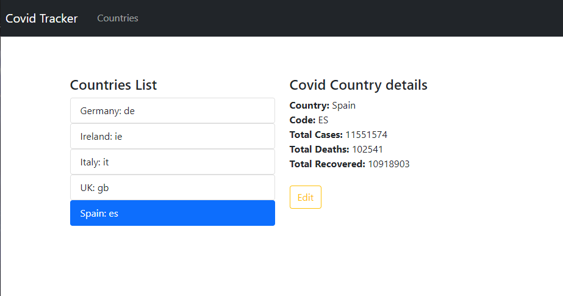
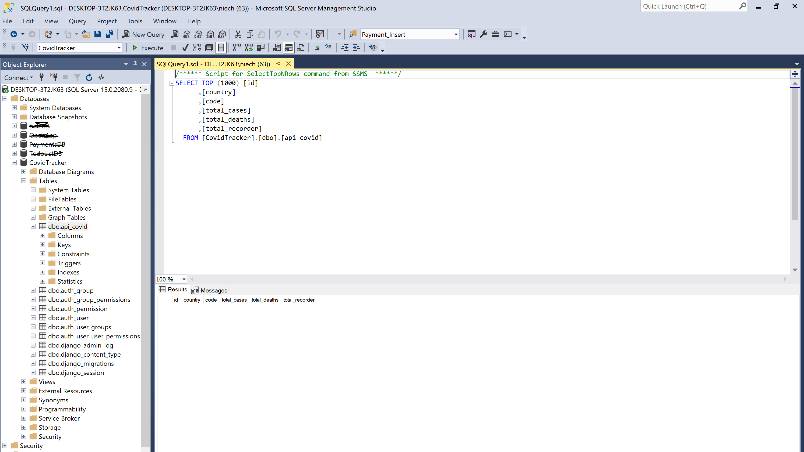

# Covid Tracker

This project is a full-stack Django project with  Angular used for the front-end.

User displays covid data(consumed from an api ) for the selected country.





# Table of Contest


- [Covid Tracker](#covid-tracker)

- [Table of Contest](#table-of-contest)

  - [_Project Goal_](#project-goal)

  - [Technologies Used](#technologies-used)

    - [Languages Used](#languages-used)

  - [Frameworks, Programmes, Database and Libraries](#frameworks-programmes-database-and-libraries)

  - [Testing](#testing)

  - [Project Initiation](#project-initiation)

    - [Create Project Enviroment(VSCode)](#create-project-enviromentvscode)

    - [Create Django app(VSCode)](#create-django-appvscode)

    - [Create GitHub repository](#create-github-repository)

  - [Database](#database)

    - [Database Model and MSSQL Connection](#database-model-and-mssql-connection)

    - [Populate DB](#populate-db)

  - [UI](#ui)

    - [App structure](#app-structure)

    - [Creating Angular App](#creating-angular-app)


## _Project Goal_


• Create a basic Django application.


• Consume the data from the disease.sh API to populate the database (of your choice) with data from all countries. A one-time setup is suitable.

• Allow for querying of the database through a REST API for the countries listed below. The user should be able to select a country from a list of countries.

• Show the data for the selected country on a web page. Minimum data that should be displayed is:

   ◦ Name of the country

   ◦ Total cases

   ◦ Total deaths

   ◦ Total recovered

• Allow the user to update the data.


• Country displayed in the application:

    • Ireland: ie

    • Germany: de

    • Italy: it

    • UK: gb

    • Spain: es


## Technologies Used


### Languages Used


* [HTML5](https://en.wikipedia.org/wiki/HTML5)


* [CSS3](https://en.wikipedia.org/wiki/CSS)


* [JavaScript](https://pl.wikipedia.org/wiki/JavaScript)


* [Python](https://www.python.org/)


## Frameworks, Programmes, Database and Libraries

* [techsini](https://techsini.com/) - to generate website mock-up. 

* [Visual Studio Code](https://code.visualstudio.com/) - used for developing this website and commit the project to GitHub repository.

* [Chrome Developer Tools](https://developers.google.com/web/tools/chrome-devtools) - used to debug the application.

* [Lucidchart](https://www.lucidchart.com/) - used to create Angular client app structure.

* [Github](https://github.com/) - Github as the hosting site was used to store the source code of this website.

* [Git](https://git-scm.com/) - used Git to commit and push code to the GitHub repository.

* [MSSQL](https://www.microsoft.com/en-ie/sql-server/sql-server-downloads) - database used in the project

* [Angular 13](https://angular.io/) - to built UI

* [Django](https://www.djangoproject.com/) - web framework used to build this application.

* [django REST framework](https://www.django-rest-framework.org/) - for building Web API.

* [postman](https://www.postman.com/) - to test API with put,get,post, delete methods.


## Testing 

1. To test API I've used [postman](https://www.postman.com/)


Comments: GET, POST, PUT, DELETE tested(img :point_up_2:)


2. UI test:

  - app displaying correct countries. - Pass

  - selecting all countries displaying correct data. - Pass

  -` update` button redirecting to countries/{id}.

  - update fields with a message displaying `This country was updated succesfully` - Pass

  - checking in SQL managment studio if Data Base updated. - Pass

  - `Back to Countries` button - Pass

  - navbar links tested - Pass

  

## Project Initiation

### Create Project Environment(VSCode)

__(You need to have installed Python extensions and Python version 3 before taking the following steps )__

1. On the local system create project folder 

2. Open folder in VS Code

3. Create a python virtual environment:

   - in vs terminal run  `py -3 -m venv .venv` and `.venv\scripts\activate`

4. Select and activate an environment (To select a specific environment, use the `Python: Select Interpreter command from the `Command Palette (Ctrl+Shift+P)`.


### Create Django app(VSCode)

1. Run in terminal: `django-admin startproject covid_tracker`

2. Test app : `python manage.py runserver`

3. Create api application in Django in terminal: `python3 manage.py startapp api` and add an application to INSTALLED_APPS in Django `settings.py`

5. Install django: `pip install djangorestframework`

6. And in `'rest_framework'` to INSTALLED_APPS in `settings.py`:


### Create GitHub repository


1. In VS Code terminal run: `git init` 

2. On Github profile create new repository

3. Copy git remote

4. Paste git remote in VS Code Terminal in the project folder.

5. Add `.gitignore` file to the project.

6. Run `git add .` in terminal

7. Commit changes `git commit -m "Initial commit"`

8. Push changes `git push origin master`

   

## Database


### Database Model and MSSQL Connection 

1. To use MSSQL database(3rd-party database backend) in  Django project we need to install [mssql-django](https://pypi.org/project/mssql-django/) - `pip install django-mssql-backend` 

2. In `settings.py`  chnage database infromation:

   ```DATABASES = {

    'default': {

        "ENGINE": "mssql",

        "NAME": "CovidTracker",

        "USER": "",

        "PASSWORD": "",

        "HOST": "DESKTOP-3T2JK63",

        "PORT": "",

        "OPTIONS": {"driver": "ODBC Driver 17 for SQL Server",

                    },

    },

}```

Comment:  we can check ODBC driver running python shell in VS CODE terminal.

3. In MSSQL Management Studio create database `CovidTracker`


4. In django `models.py` in api folder create "Covid" model.

5. In VS Code terminal create migrations : `python manage.py makemigrations`

6. And then migrate: `python manage.py migrate`

7. Go to MSSQLMS to see new created table:




### Populate DB

To populate DB with data from external API(disease.sh):

1. In api app create a management directory with a commands directory inside.

`/management/commands/`

2. Create a file (in this case `script.py`) with functions to get and upload data.

3. Run in terminal: `python manage.py script`


Docs: [How to create custom django-admin commands](https://docs.djangoproject.com/en/4.0/howto/custom-management-commands/)


## UI


### App structure


### Creating Angular App

1. In cmd in the COVIDTRACKER folder type:  `ng new client --strict false`

2. Would you like to add Angular routing? Type: `Yes`

3. Which stylesheet format would you like to use? select: `CSS`

3. To open the Vs Code terminal run: `code . `

4. Once the app is created run in the client folder `ng serve` to test the application.

5. Create a service to communicate with api in vs code terminal `ng c service api`.

6. Create components by running `ng g c components/countries list and `ng g c components/country details.

7. To create an angular model, in the terminal run: `ng g class 